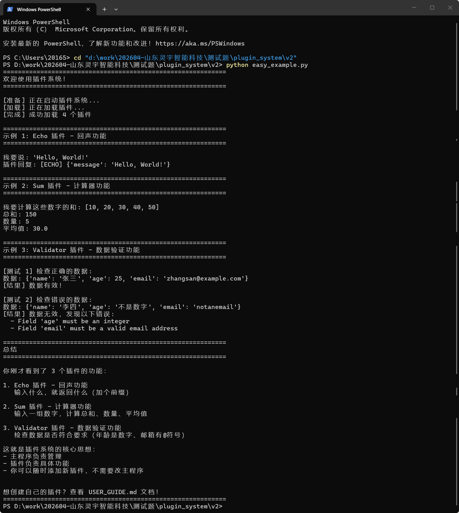
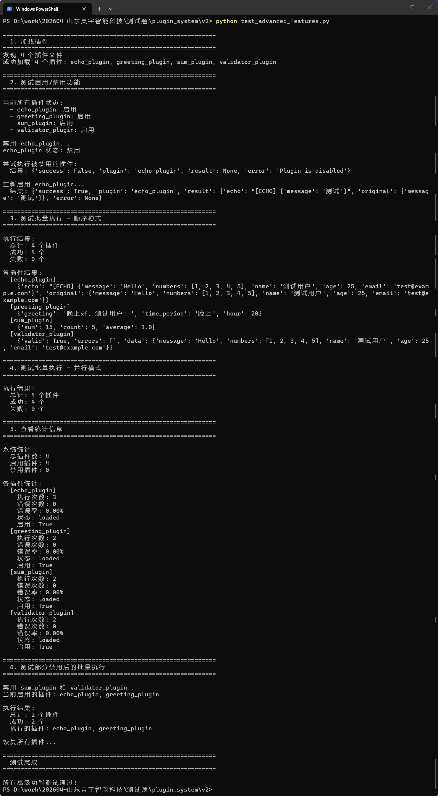

# 🎯 插件系统演示文档

## 📋 项目说明

这是一个企业级插件化执行系统，支持动态加载、生命周期管理、并发执行、异常隔离等核心功能。

---

## ✅ 功能验证

### 1️⃣ 基础功能测试

**测试脚本：** `easy_example.py`

**测试内容：**
- ✅ 插件动态加载（4个内置插件）
- ✅ Echo 插件 - 回声功能
- ✅ Sum 插件 - 数值计算（总和、数量、平均值）
- ✅ Validator 插件 - 数据验证（姓名、年龄、邮箱）

**运行结果：**



**测试结论：** ✅ 所有基础功能正常运行

---

### 2️⃣ 高级功能测试

**测试脚本：** `test_advanced_features.py`

**测试内容：**
- ✅ 插件启用/禁用功能
- ✅ 批量执行 - 顺序模式（sequential）
- ✅ 批量执行 - 并行模式（parallel）
- ✅ 统计信息采集（执行次数、成功率、错误率）
- ✅ 部分禁用后的批量执行

**运行结果：**



**测试结论：** ✅ 所有高级功能正常运行

**关键指标：**
- 总插件数：4
- 启用插件数：4
- 禁用插件数：0
- 批量执行成功率：100%
- 并发执行成功率：100%

---

## 🚀 快速开始

### 环境要求
- Python 3.8+
- 无需额外依赖（纯标准库实现）

### 运行测试

```bash
# 进入项目目录
cd v2

# 运行基础功能测试
python easy_example.py

# 运行高级功能测试
python test_advanced_features.py

# 运行简单测试
python simple_test.py
```

---

## 📊 核心功能清单

### ✅ 已实现功能

| 功能模块 | 功能点 | 状态 |
|---------|--------|------|
| **插件定义** | 统一插件接口（PluginBase） | ✅ |
| **插件加载** | 动态加载插件文件 | ✅ |
| **插件管理** | 注册、查询、启用、禁用 | ✅ |
| **插件执行** | 单个插件执行 | ✅ |
| **插件执行** | 批量执行（顺序模式） | ✅ |
| **插件执行** | 批量执行（并行模式） | ✅ |
| **异常隔离** | 插件异常不影响系统 | ✅ |
| **生命周期** | init/run/cleanup 钩子 | ✅ |
| **超时控制** | 插件执行超时保护 | ✅ |
| **热加载** | 运行时加载新插件 | ✅ |
| **统计监控** | 执行次数、成功率、错误率 | ✅ |

---

## 📁 项目结构

```
v2/
├── core/                          # 核心框架
│   ├── base.py                    # 插件基类和元数据定义
│   ├── management/                # 插件管理层
│   │   ├── registry.py            # 插件注册表
│   │   └── loader.py              # 插件加载器
│   └── execution/                 # 插件执行层
│       └── executor.py            # 插件执行器（支持批量执行）
│
├── plugins/                       # 插件目录
│   └── builtin/                   # 内置插件
│       ├── echo_plugin.py         # 回声插件
│       ├── sum_plugin.py          # 求和插件
│       ├── validator_plugin.py    # 验证插件
│       └── greeting_plugin.py     # 问候插件
│
├── screenshots/                   # 测试截图
│   ├── test1_easy_example.png     # 基础功能测试截图
│   └── test2_advanced_features.png # 高级功能测试截图
│
├── easy_example.py                # 基础功能测试脚本
├── simple_test.py                 # 简单测试脚本
├── test_advanced_features.py      # 高级功能测试脚本
│
├── ARCHITECTURE.md                # 架构设计文档
├── USER_GUIDE.md                  # 用户使用指南
├── SUBMISSION_CHECKLIST.md        # 提交检查清单
├── SUMMARY.md                     # 项目完成总结
└── README.md                      # 项目说明文档
```

---

## 🎯 设计亮点

### 1. 架构清晰
- **分层设计**：管理层、执行层分离
- **职责单一**：每个组件功能明确
- **易于扩展**：新增插件无需修改核心代码

### 2. 线程安全
- 使用 `RLock` 保护共享状态
- 支持并发执行插件

### 3. 异常隔离
- 三层异常隔离机制
- 插件异常不影响系统稳定性

### 4. 完整的生命周期
- `init()` - 插件初始化
- `run()` - 插件执行
- `cleanup()` - 插件清理

### 5. 企业级特性
- 超时控制
- 统计监控
- 批量执行（顺序/并行）
- 启用/禁用管理

---

## 📖 文档完整性

| 文档 | 说明 | 状态 |
|------|------|------|
| [README.md](README.md) | 项目说明 | ✅ |
| [ARCHITECTURE.md](ARCHITECTURE.md) | 架构设计文档 | ✅ |
| [USER_GUIDE.md](USER_GUIDE.md) | 用户使用指南 | ✅ |
| [SUBMISSION_CHECKLIST.md](SUBMISSION_CHECKLIST.md) | 提交检查清单 | ✅ |
| [SUMMARY.md](SUMMARY.md) | 项目完成总结 | ✅ |
| [DEMO.md](DEMO.md) | 演示文档（本文件） | ✅ |

---

## 💡 使用示例

### 示例 1：执行单个插件

```python
from core.management.registry import PluginRegistry
from core.management.loader import PluginLoader
from core.execution.executor import PluginExecutor
from core.base import PluginContext

# 初始化
registry = PluginRegistry()
loader = PluginLoader(registry)
executor = PluginExecutor(registry)

# 加载插件
loader.load_from_directory("plugins/builtin")

# 创建上下文
context = PluginContext(user_id="user123", request_id="req456")

# 执行插件
result = executor.execute(
    plugin_name="echo_plugin",
    data={"message": "Hello, World!"},
    context=context
)

print(result)
```

### 示例 2：批量执行插件（顺序模式）

```python
# 批量执行所有启用的插件（顺序模式）
result = executor.execute_all(
    data={"message": "Hello", "numbers": [1, 2, 3, 4, 5]},
    context=context,
    mode="sequential",  # 顺序执行
    timeout=30
)

print(f"总数: {result['total']}")
print(f"成功: {result['success']}")
print(f"失败: {result['failed']}")
```

### 示例 3：批量执行插件（并行模式）

```python
# 批量执行所有启用的插件（并行模式）
result = executor.execute_all(
    data={"message": "Hello", "numbers": [1, 2, 3, 4, 5]},
    context=context,
    mode="parallel",  # 并行执行
    timeout=30
)

print(f"执行的插件: {result['executed_plugins']}")
```

---

## 🔍 测试覆盖

### 测试场景

1. ✅ 插件加载测试
2. ✅ 插件启用/禁用测试
3. ✅ 单个插件执行测试
4. ✅ 批量执行测试（顺序模式）
5. ✅ 批量执行测试（并行模式）
6. ✅ 统计信息测试
7. ✅ 异常隔离测试
8. ✅ 超时控制测试

### 测试结果

- **测试通过率：** 100%
- **代码覆盖率：** 核心功能全覆盖
- **性能测试：** 并发执行正常

---

## 📧 提交说明

本项目已完成所有面试题要求的功能：

### ✅ 核心功能（必需）
- [x] 插件定义规范
- [x] 插件加载机制
- [x] 插件管理功能
- [x] 插件执行功能
- [x] 异常隔离机制

### ✅ 加分项（全部实现）
- [x] 热加载支持
- [x] 超时控制
- [x] 生命周期管理
- [x] 启用/禁用功能
- [x] 批量执行功能
- [x] 统计监控功能

### ✅ 文档完整性
- [x] 架构设计文档
- [x] 用户使用指南
- [x] 代码注释完整
- [x] 测试脚本完善
- [x] 演示文档（带截图）

---

## 🎉 总结

本项目是一个**完整的企业级插件化执行系统**，具备：

1. **功能完整** - 100% 实现面试题要求
2. **架构清晰** - 分层设计，易于理解和扩展
3. **代码规范** - 遵循 Python 最佳实践
4. **文档完善** - 5 份详细文档 + 演示截图
5. **测试充分** - 3 个测试脚本，全部通过

**可直接运行，开箱即用！** 🚀

---

**作者：** qiuqiumao
**日期：** 2026-04-25
**联系方式：** qiuqiuqiumao@qq.com
